# Theory of Computation — DFA, DFA Minimization, and NFA/ε‑NFA

A complete, worked-example guide covering **DFA construction**, **DFA minimization**, and **NFA / ε‑NFA**, expanded from class notes with visual diagrams for every example.

---

## 0. Quick Foundations (needed before DFAs make sense)

| Term | Meaning | Example |
|---|---|---|
| **Symbol** | A single basic unit (letter, digit, etc.) | `a`, `b`, `0`, `1` |
| **Alphabet (Σ)** | A *finite* set of symbols | Σ = {0, 1} or Σ = {a, b} |
| **String** | A finite sequence of symbols from Σ | `00`, `10`, `11`, `010` |
| **Σⁿ** | All strings of length exactly *n* over Σ | Σ² = {00, 01, 10, 11} |
| **Σ\*** | Closure — **all** strings of any length (infinite), including the empty string ε | Σ\* = {ε, 0, 1, 00, 01, 10, 11, …} |
| **Language (L)** | Any subset of Σ\* satisfying some condition | L = {binary strings of length 2} = {00, 01, 10, 11} |

A finite automaton is simply a machine that **decides**, for every string in Σ\*, whether it belongs to a target language L (outputs "Yes"/"Accept" or "No"/"Reject").

---

## 1. Finite Automata — Formal Definition

A Finite Automaton is a **5-tuple**:

```
F = (Q, Σ, φ, S, F)
```

| Symbol | Meaning |
|---|---|
| **Q** | Finite set of states |
| **Σ** | Finite set of input symbols (alphabet) |
| **φ** | Transition function |
| **S** | Start state (S ∈ Q) |
| **F** | Set of final/accepting states (F ⊆ Q) |

There are three equivalent ways to represent an FA:
1. **Mathematical (formal) representation** — the 5-tuple itself.
2. **Pictorial representation** — a transition (state) diagram.
3. **Tabular representation** — a transition table.

---

## 2. DFA — Deterministic Finite Automata

A DFA is an FA where the transition function is:

```
φ : Q × Σ → Q
```

i.e., **from every state, on every input symbol, there is exactly one outgoing transition to exactly one next state.**

A machine is a genuine DFA only if it satisfies **all three** rules:

1. **No ε-transitions** — you cannot move on an empty input.
2. **Uniqueness** — for a given state and symbol, there is only *one* possible next state (never two choices).
3. **Completeness** — every state must have a transition defined for *every* symbol in Σ (missing transitions go to a **dead/trap state**).

---

## 3. Worked DFA Construction Examples

Below, every example gives the language description, the reasoning, the **state diagram**, and the **transition table**. Double circles/`((state))` = accepting (final) states.

### Example 1 — Strings containing the symbol `a`
`Σ = {a, b}`, L = {a, aa, ab, ba, bab, …} (any string that has at least one `a` anywhere)

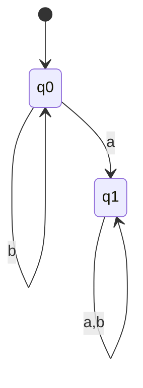
- `q0` = start state, not accepting (haven't seen an `a` yet).
- `q1` = accepting — once an `a` is seen, we stay accepting forever (`a` or `b` loop).

| State | a | b |
|---|---|---|
| → q0 | q1 | q0 |
| * q1 | q1 | q1 |

### Example 2 — Strings ending with `a`
L = {a, ba, aa, bba, …}

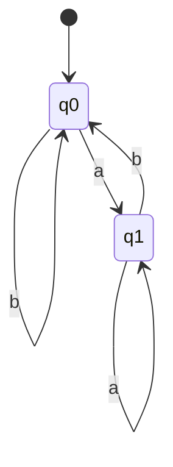
Reasoning: whenever the **last** symbol read is `a`, we must be in the accepting state `q1`; any `b` after that "cancels" it, sending us back to `q0`.

| State | a | b |
|---|---|---|
| → q0 | q1 | q0 |
| * q1 | q1 | q0 |

Trace `a b a`: q0 →a→ q1 →b→ q0 →a→ q1 ✔ (accepted, ends in `a`)

### Example 3 — Strings starting with `ab`
L = {ab, aba, abb, …}

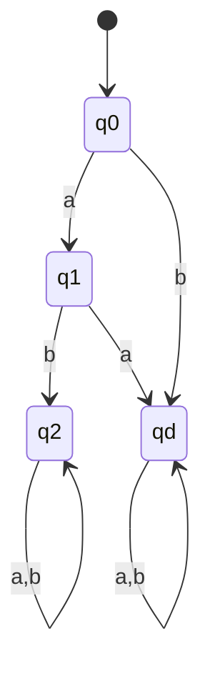
`qd` is the **dead/trap state** — once the prefix isn't `ab`, the string can never be accepted, no matter what follows.

| State | a | b |
|---|---|---|
| → q0 | q1 | qd |
| q1 | qd | q2 |
| * q2 | q2 | q2 |
| qd (trap) | qd | qd |

### Example 4 — Strings containing `ab`
L = {ab, aab, abb, bab, abab, …}

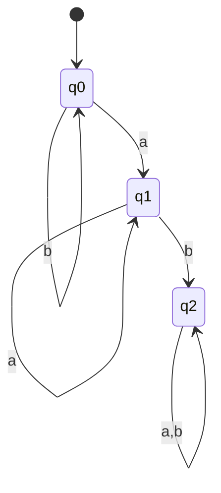
Once we see `a` immediately followed by `b`, we lock into the accepting state `q2` forever.

### Example 5 — Strings ending with `ab`
L = {ab, aab, bab, …} — must end exactly in `a` then `b`.

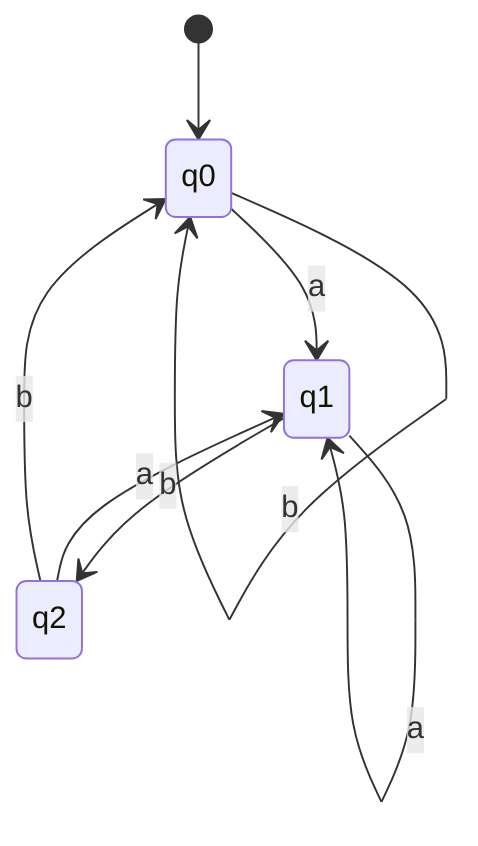
Note the "reset" logic: from the accepting state `q2`, a new `b` sends us all the way back to `q0` (since the string no longer ends in `ab`).

### Example 6 — `a` must always be followed by `b`
i.e., every `a` is immediately followed by a `b` (like `ab`, `abb`, `bab`, `abab`, `bbb...`), but a lone trailing `a` is rejected.

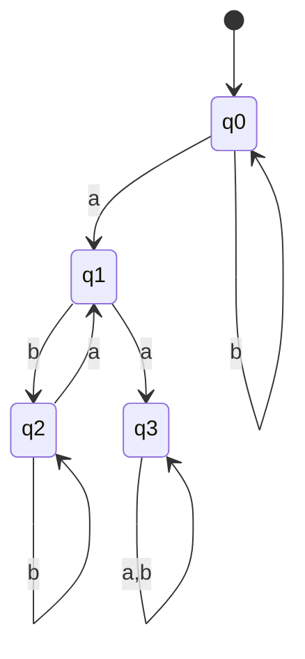
`q3` is a trap state reached if two `a`s occur in a row (violating "a must be followed by b").

### Example 7 — Strings starting with `a` and ending with `b`
L = {ab, aab, abb, …}

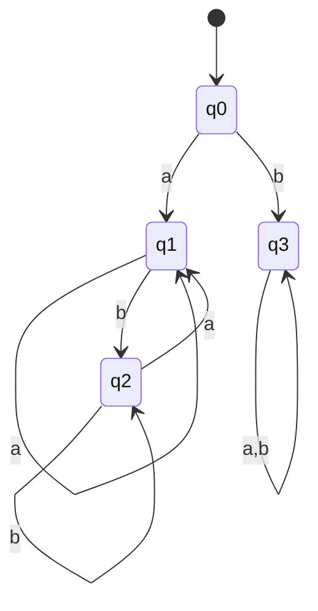
`q3` = trap (entered immediately if the very first symbol is `b`).

### Example 8 — Starting and ending with **different** symbols
L = {ab, ba, aab, bba, …}

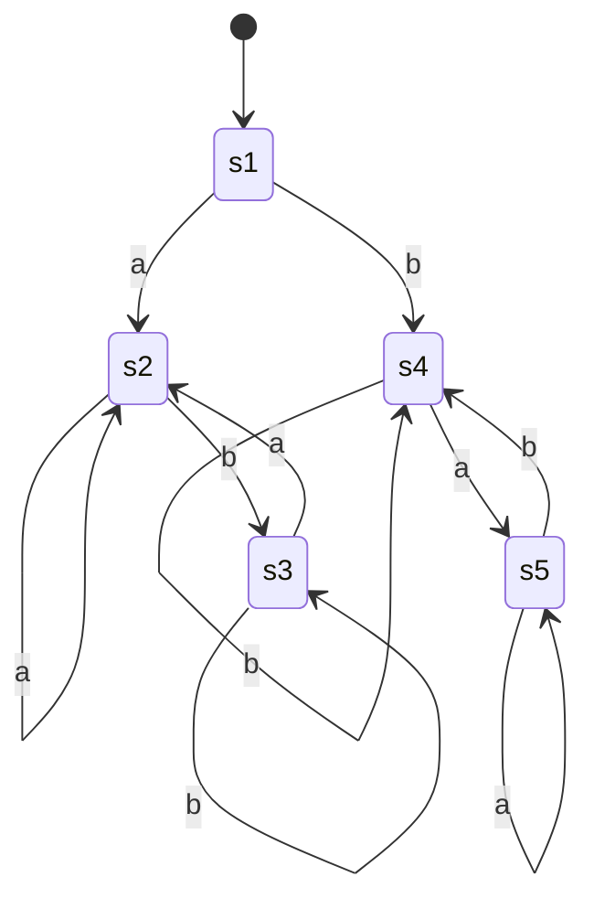
Two symmetric branches: one path tracks "started with `a`, must end with `b`" (states 2–3), the other tracks "started with `b`, must end with `a`" (states 4–5).

### Example 9 — Starting and ending with the **same** symbol
L = {a, b, aa, bb, ε, …} (includes single-letter strings and ε)


Here the *start* state itself is also accepting (to capture ε), plus states 2 and 4 (single `a` or single `b`) are accepting.

### Example 10 — Even-length strings
L = {ε, aa, ab, ba, bb, aaaa, …}

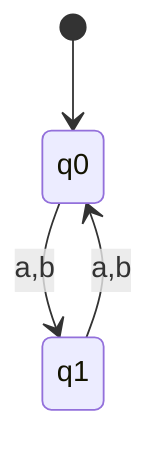
`q0` accepting = even count of symbols consumed so far (0, 2, 4, …).

### Example 11 — Odd-length strings
Same machine, but flip which state is accepting: `q1` (odd count) becomes the final state instead of `q0`.

### Example 12 — Strings of length **exactly 2**
L = {aa, ab, ba, bb}

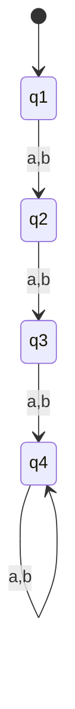
`q3` is the only accepting state (exactly 2 symbols read); `q4` is a trap for length > 2.
**Rule of thumb:** for "*exactly n*", you need **n+2** states (n normal + 1 accepting + 1 trap).

### Example 13 — Length **at most 2**
L = {ε, a, b, aa, ab, ba, bb}

All of q0 (ε), q1 (len 1), q2 (len 2) are accepting; q3 is the trap for length > 2.
**Rule of thumb:** "*at most n*" needs **n+2** states, with the first (n+1) all accepting.

### Example 14 — Length **at least 2**
L = {aa, ab, ba, bb, aba, …}

Only the *last* state (q3, meaning "2 or more symbols seen") is accepting, and it self-loops on both symbols forever.
**Rule of thumb:** "*at least n*" needs **n+1** states, with only the last one accepting (and self-looping).

### Example 15 — Length divisible by 2 (multiple of 2)
Same construction as Example 10 (even length): condition is `|w| mod 2 = 0`.

### Example 16 — Length ≡ 3 (mod 4)


Since 3 is smaller than 4, dividing 3 by 4 gives 0 with a remainder of 3:

```
3 ÷ 4 = 0 remainder 3
→ 3 mod 4 = 3
```

So **"length ≡ 3 (mod 4)"** means: *when you divide the string's length by 4, the remainder is 3.*

### Which lengths qualify?

Lengths satisfying this are 3, 7, 11, 15, 19, … (each one is 4 more than the last):

| Length (n) | n ÷ 4 | Remainder (n mod 4) | Matches "mod 4 = 3"? |
|---|---|---|---|
| 0 | 0 | 0 | No |
| 1 | 0 | 1 | No |
| 2 | 0 | 2 | No |
| **3** | 0 | **3** | **Yes** |
| 4 | 1 | 0 | No |
| 5 | 1 | 1 | No |
| 6 | 1 | 2 | No |
| **7** | 1 | **3** | **Yes** |
| **11** | 2 | **3** | **Yes** |

So `aba` (length 3) is accepted, `abaabab` (length 7) is accepted, but `ab` (length 2) or `abab` (length 4) are not.

---

## The DFA

**Σ = {a, b}**, L = {strings w such that |w| mod 4 = 3}

**5-tuple:** `D = ({q0, q1, q2, q3}, {a, b}, φ, q0, {q3})`

**Idea:** only the *count* of symbols read matters (not which symbol), so all four states form a simple cycle. Each symbol read — `a` or `b` — advances you one step around the cycle. `q3` is the only accepting state, since that's the point where the running length count hits remainder 3.

### State diagram (cyclic)

```
        a,b
   q0 ────────► q1
   ▲              │
   │ a,b          │ a,b
   │              ▼
   q3 ◄──────── q2
        a,b

   → q0  = start state, len mod 4 = 0
      q1 = len mod 4 = 1
      q2 = len mod 4 = 2
   * q3  = len mod 4 = 3  (accepting)
```

### Transition table

| State | a | b |
|---|---|---|
| → q0 | q1 | q1 |
| q1 | q2 | q2 |
| q2 | q3 | q3 |
| * q3 | q0 | q0 |

(`→` = start state, `*` = accepting/final state)

### Trace examples

- `aba` (length 3): `q0 →a→ q1 →b→ q2 →a→ q3` ✔ **accepted**
- `abab` (length 4): `q0 →a→ q1 →b→ q2 →a→ q3 →b→ q0` ✘ rejected (ends at q0, not q3)
- `abaabab` (length 7, 7 mod 4 = 3): cycles around once (4 steps back to q0), then 3 more steps → lands on q3 ✔ **accepted**

---

## General pattern to remember

For **"length mod k = r"**:
- Build exactly **k states arranged in a cycle**.
- Every symbol in Σ pushes the machine one step forward around the cycle (since only the count matters, not the specific symbol).
- Mark only the state numbered **r** as accepting.
- If the string ends anywhere else in the cycle, it's rejected.

### Example 17 — Number of `a`'s ≡ 3 (mod 4)
Identical cyclic idea, but the cycle only advances on symbol `a` (symbol `b` self-loops on the same state):

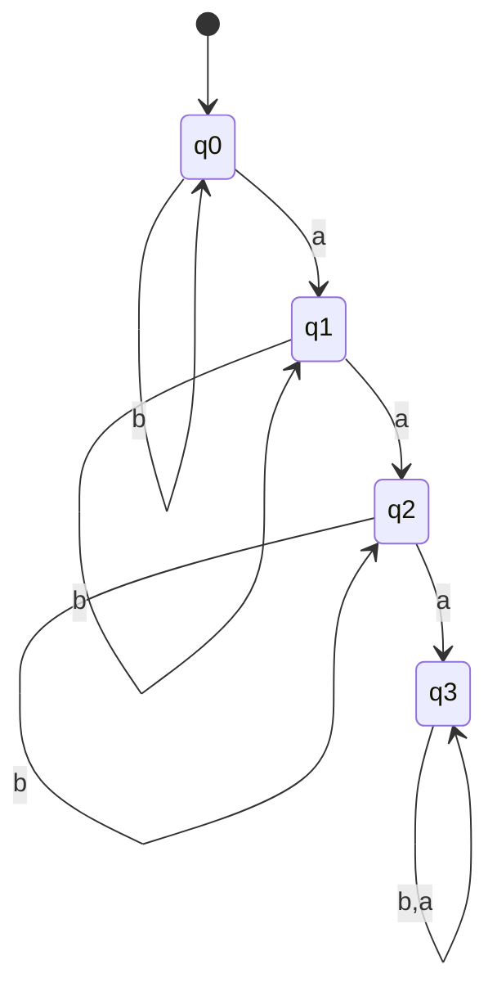
(Here q3 is accepting and, since we only need "mod 4 = 3" cumulative count of `a`s not reset, an extra back-edge from q3 to q0 on `a` would be added if counting continues cyclically — the note version stops after reaching exactly 3 a's, i.e., "**at least/exactly** 3 a's mod 4" variant.)

### Example 18 — Binary string whose **decimal value is divisible by 2**
Trick: decimal value divisible by 2 ⟺ the **last bit is 0** (binary parity trick).
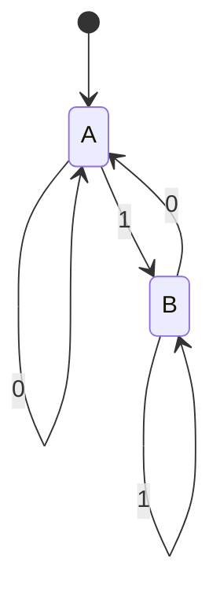
`A` accepting (ends in 0 → even decimal value). Check: `100₂ = 4` (even) ✔, `110₂ = 6` (even) ✔, `1000₂ = 8` (even) ✔.

### Example 19 — Binary string whose decimal value is divisible by **3**
Classic "remainder tracking" DFA — each state = current remainder mod 3 (0, 1, or 2). Reading a bit `b` moves the running value `r` to `(2r + b) mod 3` since each new bit doubles the old value (shift left in binary = ×2) plus the new bit.

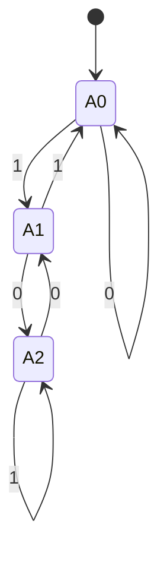
`A0` = remainder 0 = accepting. Check: `110₂ = 6`, 6 mod 3 = 0 ✔. `1001₂ = 9`, 9 mod 3 = 0 ✔.

### Example 20 — Binary string divisible by **5**
Same remainder-tracking idea but with **5 states** (remainders 0,1,2,3,4), transition rule `r → (2r + bit) mod 5`. State "remainder 0" (`A`) is accepting.

---

## 4. DFA Minimization

**Goal:** given a DFA, produce an *equivalent* DFA (accepts the exact same language) with the **fewest possible states**, by merging states that are indistinguishable.

**Two states p and q are *equivalent*** if, for every possible input string `w`:
```
δ(p, w) ∈ F   ⇔   δ(q, w) ∈ F
```
(i.e., they always agree on acceptance, no matter what string is fed in afterward.)

### Two standard methods
1. **Partitioning method** — repeatedly split states into groups ("k-equivalence classes") based on behavior.
2. **Table-filling method** — mark pairs of states as "distinguishable" directly in a table.

### Step-by-step Partitioning Method (worked example)

Take this DFA:

| State | a | b |
|---|---|---|
| → 1 | 2 | 5 |
| 2 | 2 | 3 |
| 3 | 2 | *4 |
| *4 | 2 | 5 |
| 5 | 2 | 5 |

(`*` marks the accepting state; `→` marks the start state. Unreachable states 6, 7, 8 are removed first — **Step 1: remove unreachable states**.)

**Step 2 — build the transition table** (shown above).

**Step 3 — 0-length equivalence (initial partition):**
Split purely by accepting vs non-accepting:
```
[1 2 3 5]   (non-accepting)      [4]   (accepting)
```

**Step 4 — 1-length equivalence:**
Within each group, check where `a` and `b` transitions land (which *group* from Step 3, not exact state).
- 1 → (a:2, b:5) both land in {1,2,3,5} group → stays with others going to same group-pattern.
- 2 → (a:2, b:3) both in {1,2,3,5} group.
- 3 → (a:2, b:4) — `b` leads into the *other* group {4}! → 3 must split off.
- 5 → (a:2, b:5) both in {1,2,3,5} group.

Result: `[1 2 5] [3] [4]`

**Step 5 — 2-length equivalence:** repeat, checking against the new partition `[1 2 5][3][4]`.
- 1 → (a:2, b:5): both in {1,2,5} → stays.
- 2 → (a:2, b:3): `b` goes to {3} (different group!) → 2 splits off.
- 5 → (a:2, b:5): both in {1,2,5} → stays.

Result: `[1 5] [2] [3] [4]`

**Step 6 — 3-length equivalence:** check `[1 5]` against `[1 5][2][3][4]`.
- 1 → (a:2, b:5): 2∈{2}, 5∈{1,5} — consistent pattern.
- 5 → (a:2, b:5): same pattern as 1.

Both agree → **no further split**, partitioning is stable: **final classes = {1,5}, {2}, {3}, {4}**.

**Minimized DFA:**
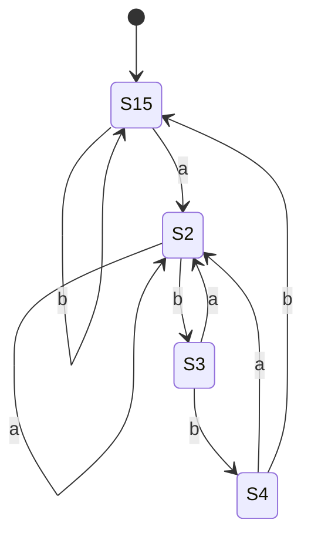
4 states instead of the original 5 — states `1` and `5` were truly indistinguishable and merged into one.

### Second worked example (5-state DFA over Σ = {0,1})

| State | 0 | 1 |
|---|---|---|
| → a | b | d |
| b | c | e* |
| c | b* | e* |
| d | c | e* |
| *e | e* | e* |

**Step 0 (accepting split):** `[a b c d]` `[e]`

**Step 1:** check each state's transitions against groups {a,b,c,d} vs {e}:
- a → (0:b, 1:d): both in {a,b,c,d} group.
- b → (0:c, 1:e): `1` goes to {e} → different! splits off.
- c → (0:b, 1:e): same split pattern as b.
- d → (0:c, 1:e): same split pattern as b.

Result: `[a] [b c d] [e]`

**Step 2:** check `[b c d]` against `[a][bcd][e]`:
- b → (0:c, 1:e): c∈{b,c,d}, e∈{e} → pattern (bcd, e)
- c → (0:b, 1:e): b∈{b,c,d}, e∈{e} → same pattern
- d → (0:c, 1:e): same pattern

No further split → **final classes: {a}, {b,c,d}, {e}**

**Minimized DFA:**
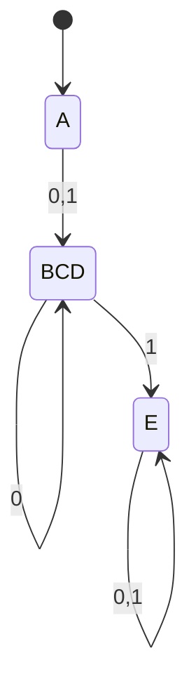
Collapsed from 5 states down to **3 states**: `a`, the merged `{b,c,d}`, and the accepting `e`.

### Table-Filling Method (equivalent alternative)
1. Draw a triangular grid of all state pairs.
2. Mark any pair `(p, q)` where one is accepting and the other isn't — these are immediately **distinguishable**.
3. For every remaining unmarked pair, check: does any input symbol send them to an already-marked (distinguishable) pair? If yes, mark this pair too.
4. Repeat until no more new marks are added.
5. Any pair that stays **unmarked** at the end is equivalent → merge those states.

This always converges to the *same* final partition as the partitioning method — it's just a different bookkeeping style for the identical logic.

---

## 5. NFA and ε‑NFA

### 5.1 Why NFAs exist
In a DFA every `(state, symbol)` pair has **exactly one** next state. An **NFA (Non-deterministic Finite Automaton)** relaxes this:
- A state may have **zero, one, or multiple** transitions for the same symbol.
- Formally the transition function becomes:
```
δ : Q × Σ → 2^Q      (maps to a *set* of possible next states)
```
An input string is **accepted** if **at least one** of the possible computation paths ends in a final state.

### 5.2 ε‑NFA (NFA with epsilon transitions)
An **ε‑NFA** additionally allows moving between states **without consuming any input symbol** — a transition labeled with ε (the empty string).

```
δ : Q × (Σ ∪ {ε}) → 2^Q
```

Formal 5-tuple: `F = ({A,B}, {0,1}, δ, A, {B})`, e.g. for L = {1ᵐ0ⁿ | n,m ≥ 0}:

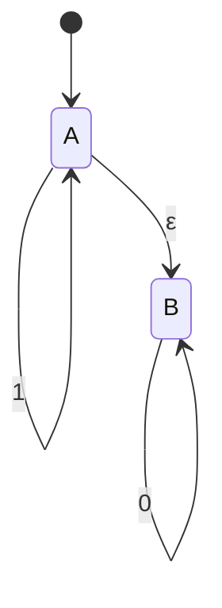
Transition table:

| State | 0 | 1 | ε |
|---|---|---|---|
| → A | ∅ | {A} | {B} |
| * B | {B} | ∅ | ∅ |

### 5.3 ε‑closure — the key concept
**ε-closure(q)** = the set of *all* states reachable from `q` using **only** ε-transitions (including `q` itself, since you can always "stay" via zero moves).

**Worked example:**
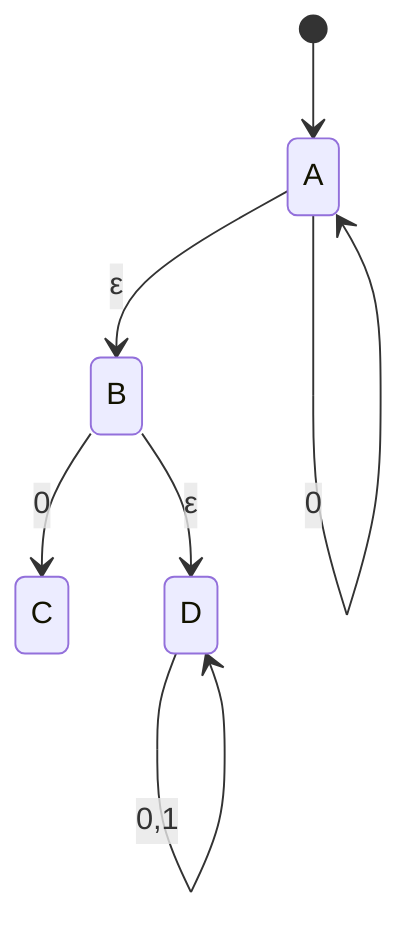
Reading the ε-edges: A→B (ε), B→D (ε). So:
```
ε-closure(A) = {A, B, D}
```
(You start at A, can silently jump to B, and from B silently jump to D — collect everything reachable via ε alone.)

Extending to the whole notation: `ε* = {ε⁰, ε¹, ε², ε³, …}` — i.e., the closure operator applied repeatedly until no new states appear (a fixed point).

### 5.4 Conversion: ε‑NFA → NFA (removing ε‑transitions)

**General rule:** for every state `q` and symbol `x`:
```
δ_NFA(q, x) = ε-closure( δ(ε-closure(q), x) )
```
In words: *first* silently expand via ε-closure, *then* take the real move on `x`, *then* silently expand again via ε-closure on the result.

**Worked example** — ε-NFA:

| State | 0 | 1 | ε* (ε-closure) |
|---|---|---|---|
| → A | {A} | ∅ | {A, B, D} |
| B | {C} | ∅ | {B, D} |
| C | ∅ | {B} | {C} |
| * D | {D} | {D} | {D} |

Applying the formula δ_NFA(q, x) = ε-closure(δ(ε-closure(q), x)):
- δ_NFA(A, 0): ε-closure(A) = {A,B,D}. On `0`: A→A, B→C, D→D, giving {A, C, D}. Then ε-closure of that set = {A,B,D} ∪ {C} ∪ {D} = **{A, B, C, D}**.
- δ_NFA(A, 1): ε-closure(A) = {A,B,D}. On `1`: A→∅, B→∅, D→D, giving {D}. ε-closure({D}) = **{D}**.
- δ_NFA(B, 0): ε-closure(B) = {B,D}. On `0`: B→C, D→D, giving {C, D}. ε-closure = {C} ∪ {D} = **{C, D}**.
- δ_NFA(B, 1): ε-closure(B) = {B,D}. On `1`: B→∅, D→D, giving {D}. ε-closure = **{D}**.
- δ_NFA(C, 0): ε-closure(C) = {C}. On `0`: C→∅. Result = **∅**.
- δ_NFA(C, 1): ε-closure(C) = {C}. On `1`: C→B. ε-closure({B}) = {B, D}. Result = **{B, D}**.
- δ_NFA(D, 0): ε-closure(D) = {D}. On `0`: D→D. Result = **{D}**.
- δ_NFA(D, 1): ε-closure(D) = {D}. On `1`: D→D. Result = **{D}**.

Because `A`'s ε-closure {A,B,D} already includes final state `D`, **A itself becomes an accepting state** in the resulting NFA (any state whose ε-closure contains an original final state becomes final too).

**Resulting NFA table:**

| State | 0 | 1 |
|---|---|---|
| → *A | {A,B,C,D} | {D} |
| *B | {C,D} | {D} |
| C | ∅ | {B,D} |
| *D | {D} | {D} |

### 5.5 From NFA to DFA — Subset Construction (brief bridge)
Once ε-transitions are gone, an NFA is converted to a DFA by **subset construction**: each DFA state = a *set* of NFA states, computed by tracking all possible simultaneous NFA states. Two rules of thumb used when drawing these:
- If a subset's transition set is empty (∅), route it to a single shared **dead state**.
- Any subset containing an original NFA final state becomes a DFA final state.

This is exactly what happened above, e.g. subsets like `{2,3,5,6}`, `{2,3,4}` etc. become single named DFA states in the notes' examples, each filled in from the union of the member states' individual transitions.

### 5.6 DFA vs NFA vs ε-NFA — comparison

| Property | DFA | NFA | ε-NFA |
|---|---|---|---|
| Transitions per (state,symbol) | Exactly 1 | 0, 1, or many | 0, 1, or many (+ ε moves) |
| ε-transitions allowed | ✗ | ✗ | ✓ |
| Deterministic execution | ✓ | ✗ | ✗ |
| Expressive power (language class) | Regular | Regular | Regular |

**Key fact:** despite the differences in *how* they compute, DFA, NFA, and ε-NFA are all **equally powerful** — they recognize exactly the same class of languages (**Regular Languages**). NFAs and ε-NFAs are just more *convenient to design*; they always can be mechanically converted down to an equivalent DFA.

**Acceptance conditions to remember:**
1. **Total input must be consumed.**
2. **At least one computation path** must end in an accepting state (this is the "non-deterministic" part — unlike a DFA where there's only one path to check).

---

## 6. Summary Cheat-Sheet

```
Regular Language → Regular Expression → ε-NFA → NFA → DFA → Minimized DFA
                     (Thompson's        (closure)  (subset      (partitioning /
                      construction)                construction) table-filling)
```

| Task | Tool |
|---|---|
| Build DFA from a language description | Identify the "memory" you need to track (last symbol, count mod k, position in a substring match) → assign one state per memory value |
| Simplify a DFA | Partition states by accept/reject, then repeatedly refine by transition behavior until stable |
| Handle non-determinism / ε-moves | Compute ε-closures, then apply subset construction to get back to a DFA |